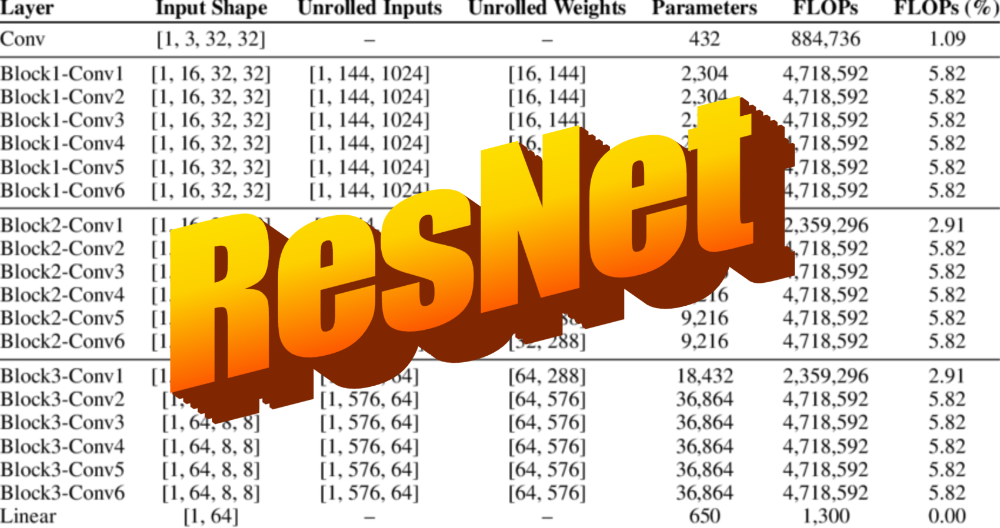

# ResNet Model Training and Evaluation

## Description
This repo focus on training and evaluating __ResNet__ models for image classification. Possible to experiment with different ResNet architecture (e.g., ResNet9 and ResNet20) and custom hyperparams like *lr*, *batch size* and *epochs*.

This repo is best suited to be used in a __Google Collab__ instance.

## Key Features and Concepts
### ResNet Architecture : 
According to the original ResNet paper[[1]](#1), the author discusses the case of CIFAR10 in section 4.2 CIFAR-10 and Analysis, providing the following table:

| **output map size** | **32 x 32** | **16 x 16** | **8 x 8** |
|---------------------|-------------|-------------|-----------|
| **# layers**        | 1 + 2n      | 2n          | 2n        |
| **# filters**       | 16          | 32          | 64        |

**Table: ResNet parameters for CIFAR-10**

Choosed $n=1$ for simplicity, leading to a ResNet20 architecture.

### OneCycle Learning Rate Policy: 
This project utilizes the OneCycleLR scheduler[[2]](#2) to dynamically adjust the learning rate during training, which can lead to faster convergence and better performance.

### Data Augmentation:
The model’s ability to generalize must therefore be high. Data augmentation[[3]](#3), such as __random cropping__, __flipping__ and __rotation__ are implemented. Similarly, to speed up the training process, the dataset is normalized. Thoses transformations are only used on the training set. The validation and testing one are not altered by it.

### Adam Optimizer:
The project uses Adam[[4]](#4) for optimization, which combines the advantages of RMSProp and Stochastic Gradient Descent (SGD). Adam is widely used due to its adaptive learning rate and momentum.


## Model Training
You can train a ResNet model (either ResNet9 or ResNet20) with customizable hyperparameters. Below is an example of how to use the command-line options.
### Usage 
To train with default settings (ResNet20, 8 epochs, batchsize = 5):
```python
python train.py --save-path checkpoints/ --data data/
```
To train with a specific model (e.g., ResNet9) and custom hyperparams:
```python
python train.py --model ResNet9 --epochs 15 --learning-rate 0.01 --batch-size 32 --save-path checkpoints/ --data data/
```
### Available Options:
  - `--model`: Selects the model to use (ResNet9 or ResNet20).
  - `--epochs`: Number of epochs for training.
  - `--learning-rate`: Learning rate for the optimizer.
  - `--batch-size`: Batch size for the training data.
  - `--save-path`: Directory to save the model checkpoints.
  - `--data`: Directory where the dataset is stored.

## Results
To arrive to the current checkpoint, the Adam Optimizer and the CrossEntropyLoss are both used. With the following hyperparameters : 
- epochs = 8
- lr = 0.01
- batch size = 5,
  a train accuracy of ~ 91% is achieved on cifar10 with a validation accuracy of 83%.As for testing accuracy, we’re at around 84%, which is a pretty good performance for a model that’s not that deep.
  
## Bibliography
<a id="1">[1]</a> : Kaiming He et al. *Deep Residual Learning for Image Recognition.* 2015. [arXiv:1512.03385](https://arxiv.org/abs/1512.03385) [cs.CV].

<a id="2">[2]</a> : Leslie N. Smith and Nicholay Topin. *Super-Convergence: Very Fast Training of Neu- ral Networks Using Large Learning Rates.* 2018. [arXiv:1708.07120](https://arxiv.org/abs/1708.07120) [cs.LG].

<a id="3">[3]</a> : GE Hinton et al. *Improving neural networks by preventing co-adaptation of feature detectors.* 2012. [arXiv:1207.0580](https://arxiv.org/abs/1207.0580) [cs.NE].

<a id="4">[4]</a> : Diederik P. Kingma and Jimmy Ba. *Adam: A Method for Stochastic Optimization.* 2017. [arXiv:1412.6980](https://arxiv.org/abs/1412.6980) [cs.LG]
